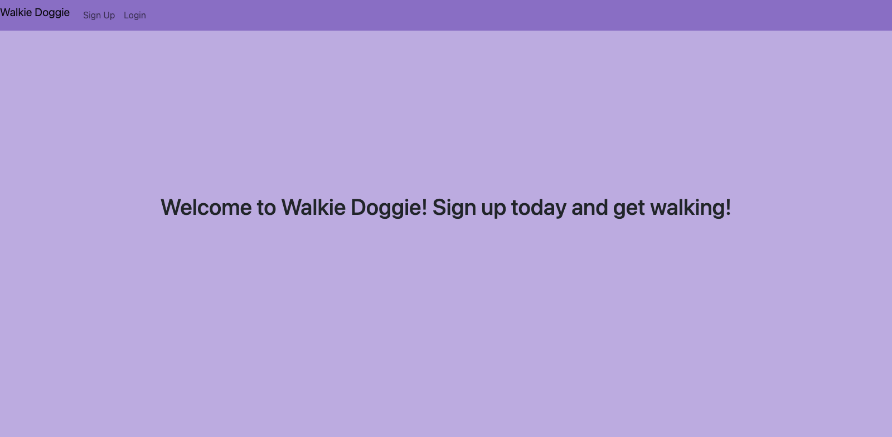
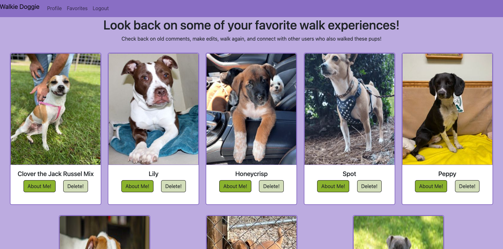

# Walkie Doggie!
Join [here!](https://walkie-doggie-project2.herokuapp.com/)

## Overview

## Project Description
You will use this app to view dogs in need of some company/care during the day. These pup parents have busy lives and would really appreciate the help. Take a buddy on a walk today!

## API usage
I will be using the [adopt a pet API](https://www.adoptapet.com/public/apis/pet_list.html)

## Installation Instructions
1. Fork and git clone repository
2. Npm I (to install all dependencies)
3. Create .env file and set ENC_KEY value of your desire in this folder
4. Echo .env >> .gitignore & echo node_modules >> .gitignore
5. Request key and secret from API, then set these values = API_KEY & API_SECRET also in the .env file
6. Ready to go!

## ERD

## RESTful Routing Chart

| VERB | URL pattern | Action \(CRUD\) | Description |
| :--- | :--- | :--- | :--- |
| GET | / | Show \(Read\) | home page with login and  sign up links |
| GET | /users/new | Show \(Read\) | create a new user |
| POST | /users | New \(Read\) | renders a sign up form |
| GET | /users/login | New \(Read\) | renders a login form |
| POST | /users/login | Create \(Create\) | logs in existing user |
| GET | /users/logout | Show \(Read\) | logs user out |
| GET | /users/profile | Show \(Read\) | renders users profile page |
| GET | /users/home | Show \(Read\) | renders home page |
| GET | /pets/browse | Show \(Read\) | renders browse page |
| GET | /pets/:id | Show \(Read\) | renders about page with info on specific pet |
| GET | /users/pets/favorites | Show \(Read\) | list users saved favorites |
| POST | /pets/favorites | Create \(Create\) | list users saved favorites |
| DELETE | /pets/favorites/:id | Destroy \(Delete\) | list users saved favorites |
| POST | /pets/:id | Create \(Create\) | creates comments connected to specific pet |
| DELETE | /pets/:petId/comments/:id | Destroy \(Delete\) | deletes comments connected to specific pet |
| GET | /comments/:id/edit | Show \(Read\) | renders a form to edit existing comments |
| PUT | /comments/:id/edit | Update \(Update\) | updates existing comment |

## Wireframes

# On Load

# Login

# Sign Up

# Homepage

# Browse

# About

# Profile

# Favorites

# Edit

## User Stories
As a user I want to be able to ligin or sign up for an account so that I can browse available pets for walking and save the ones that I am interested in. As a user I want to be able to look at my favorites, delete them, and also have them save after logout so that they are able to be accessed at different times. As well as saving to favorites, as a user I want to be able to comment on my favorites walk experiences and edit/delete comments.

## MVP Goals
- [] Render all pages listed above
- [] Encrypt usernames and emails and hash passwords for secure keeping
- [] Add the ability to browse available pets for adoption
- [] Have the ability to add to a list of favs
- [] Login attempt messages and sign up messages
- [] Render an error template
- [] Ability to delete from favs
- [] Ability to add comments to dogs
- [] Ability to delete/edit comments
- [] Logout and cookie clear ability
- [] Save fav list information after logout
- [] Only users loggin in can view their own favs and delete/edit comments they have made

## Stretch Goals
- [] Render a search by key words to increase user view
- [] Add profile specifications for users
- [] 2 levels of auth, walker, walkee
