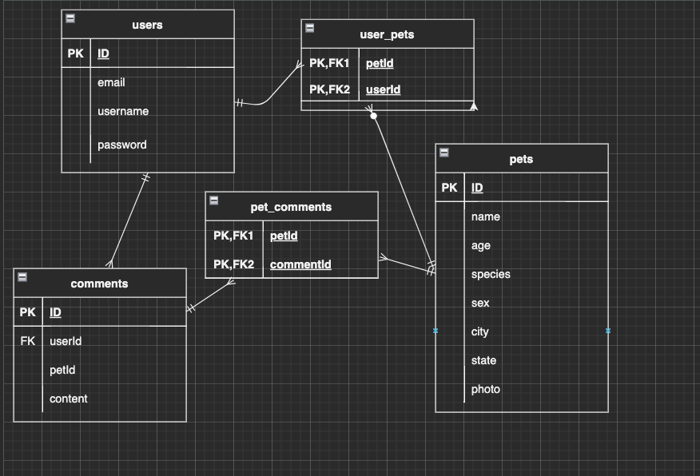
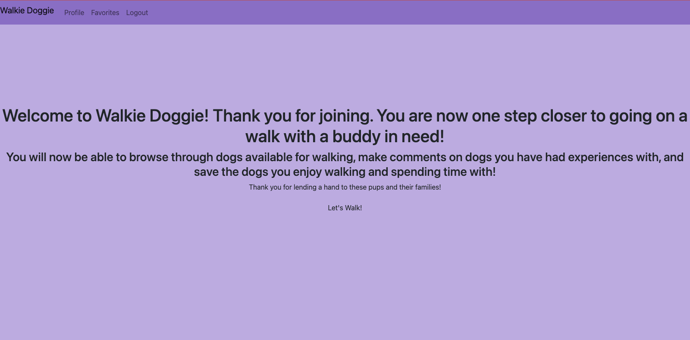
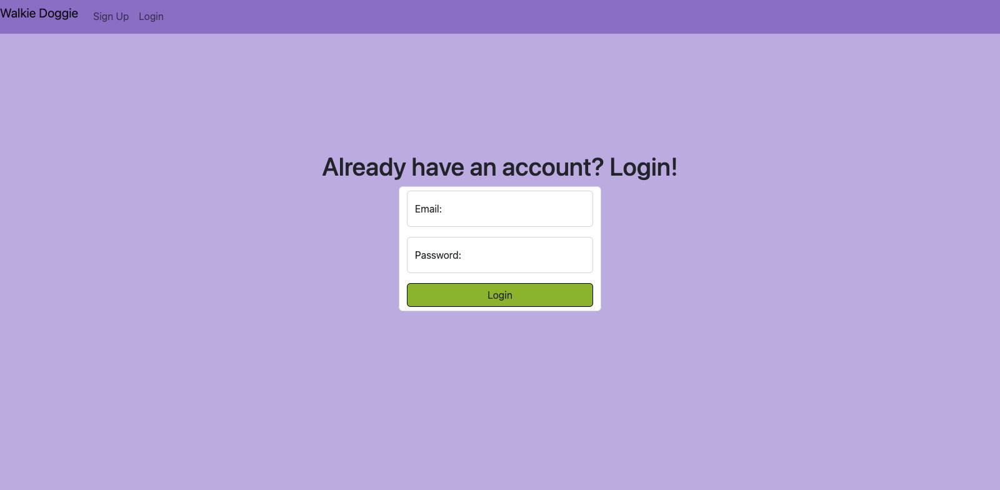
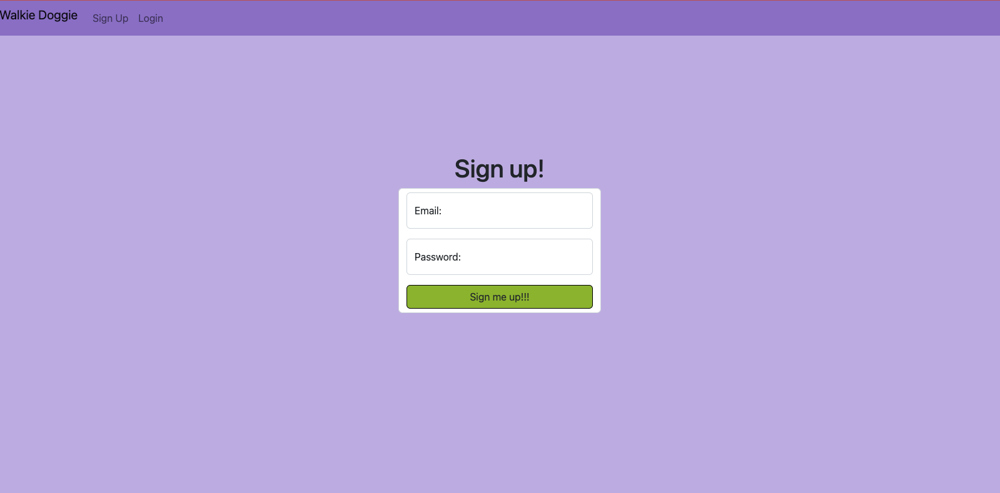
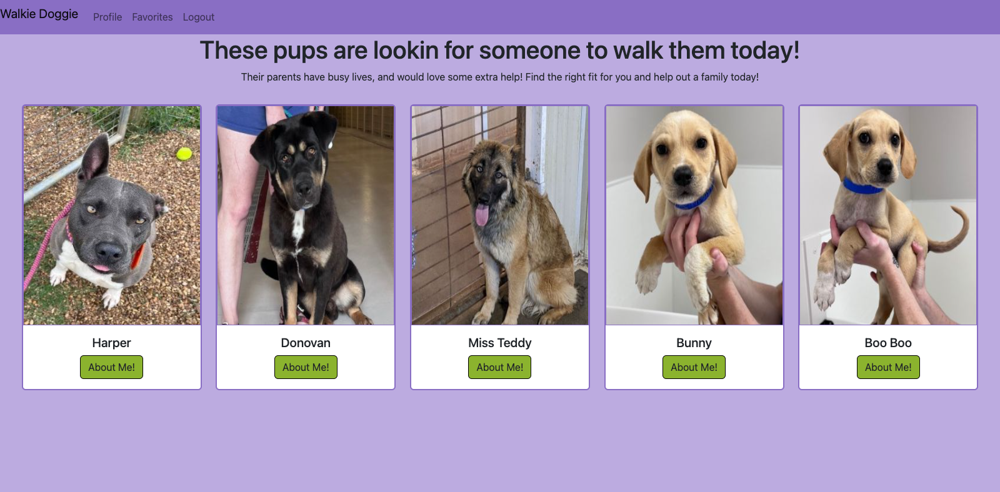
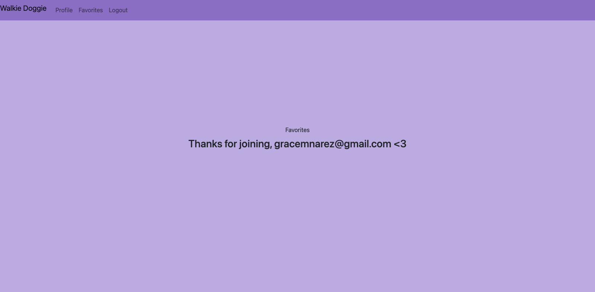
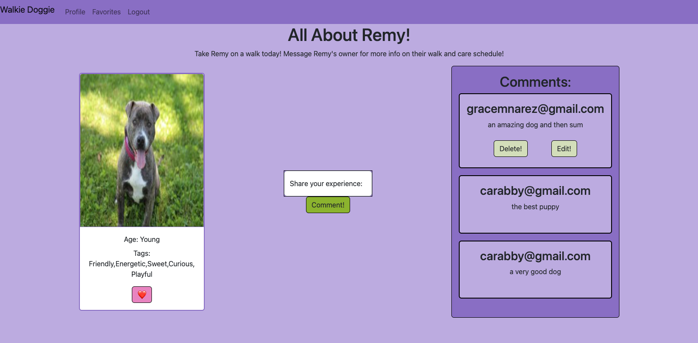

# Adopt a pet!

## Overview

## Project Description
You will use this app to view animals available for adoption and spotlight the one's you are interested in possibly adopting!

## API usage
I will be using the [adopt a pet API](https://www.adoptapet.com/public/apis/pet_list.html)

## ERD

## RESTful Routing Chart
* this is still being edited i think

| VERB | URL pattern | Action \(CRUD\) | Description |
| :--- | :--- | :--- | :--- |
| GET | / | Index \(Read\) | home page with login and  sign up |
| GET | /login | New \(Read\) | login form |
| POST | /signup | Create \(Create\) | creates a new user |
| GET | /pet | Show \(Read\) | lists all available pets |
| GET | /pet/:id | Show \(Read\) | list information about a specific pet |
| PUT | /favs/:id | Update \(Update\) | adds a pet to favorites |
| DELETE | /favs/pet/:id | Destroy \(Delete\) | deletes the pet from faves |

## Wireframes

# Homepage

# Login

# Sign Up

# Browse

# Profile

# About

## User Stories
As a user I want to be able to ligin or sign up for an account so that I can browse available pets for adoption and save the ones that I am interested in. As a user I want to be able to look at my favorites, delete them, and also have them save after logout so that they are able to be accessed at different times.s

## MVP Goals
- [] Render all pages listed above
- [] Encrypt usernames and emails and hash passwords for secure keeping
- [] Add the ability to browse available pets for adoption
- [] Have the ability to add to a list of favs
- [] Login attempt messages and sign up messages
- [] Render an error template
- [] Ability to delete from favs
- [] Logout and cookie clear ability
- [] Save fav list information after logout

## Stretch Goals
- [] Add ability to 'Adopt' pet
- [] Render a search by key words to increase user view
- [] Add profile specifications for potential adoptees
- [] Add breeds model table 
- [] 2 levels of auth, adopter, adoptee
